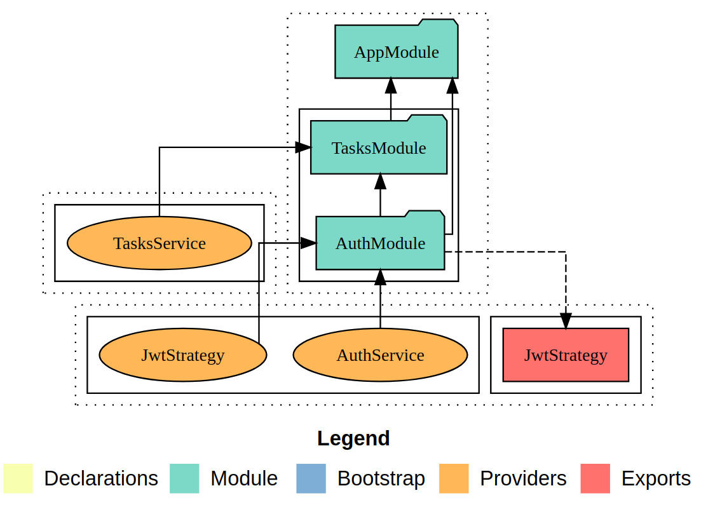

<p align="center">
  <a href="http://nestjs.com/" target="blank"></a>
</p>

[circleci-image]: https://img.shields.io/circleci/build/github/nestjs/nest/master?token=abc123def456
[circleci-url]: https://circleci.com/gh/nestjs/nest

<p align="center">Build with <a href="https://nestjs.com" target="_blank">NestJS</a> framework</p>
<p align="center">
<a href="#" target="_blank"></a>
</p>

# Task Management

This is a service to manage tasks.

It's necessary to create a user to use the system.
A user can only manage his own tasks.

This project is a back-end application using REST API to allow user register, user authentication, and task management.

## Description

A Task has the following attributes:

| Field name  |        Description         |                 Type                  | Default |
| :---------: | :------------------------: | :-----------------------------------: | ------- |
|    title    |        Name of task        |                string                 |         |
| description | Explanation about the task |                string                 |         |
|   status    | Current status of the task | string, enum: OPEN, IN_PROGRESS, DONE | OPEN    |

## Main technologies used

- [NestJS](http://nestjs.com) a Typescript framework for Node.js
- [Postgres](https://www.postgresql.org) as database
- [Jest](https://jestjs.io) for unit tests
- [JWT](https://jwt.io) for Authentication
- [ESLint](https://eslint.org) and [Prettier](https://prettier.io)
- [Husky](https://github.com/typicode/husky) to force syntax checking before commits

## Highlights

- 100% coverage with unit tests

## Requirements

### For local usage:

- [Node.js](https://nodejs.org) (v14)
- [npm](https://www.npmjs.com)
- [Postgres](https://www.postgresql.org) (v13)

### For local usage with Docker:

- [Docker Engine](https://docs.docker.com/install)
- [Docker Compose](https://docs.docker.com/compose/install)

## Running

### With Docker

- Be sure you have [Docker](https://docs.docker.com/get-docker) and [docker-compose](https://docs.docker.com/compose) installed.
- Run:

```bash
docker-compose up
```

- Use this base URL for API connection: [http://10.12.0.2:3000](http://10.12.0.2:3000)

#### Application container

```bash
docker exec -it taskmanagement_tasks bash
```

#### Extras

##### pgAdmin - PostgreSQL Tools

Optionally, to use pgAdmin:

- Run:

```bash
cd extras && docker-compose up
```

- Use your _browser_ and access [http://10.12.0.4](http://10.12.0.4)
- Login as **leogomesdev@domain.com**, password **123456**
- "Add New Server" using .env.example credentials
- Enjoy it!

### Without Docker

```bash
$ cp -v .env.example .env
```

- Edit .env file to provide database connection configs

```bash
$ npm install

# development
$ npm run start

# watch mode
$ npm run start:dev

# production mode
$ npm run start:prod
```

## Usage

Consult the API documentation [available at swagger](https://app.swaggerhub.com/apis-docs/leogomesdev/Task_Management/1.0.0) (OpenAPI 3.0)

### TL;DR

1. Open [Postman application](https://www.postman.com)
2. Import [this collection](docs/NestJS%20Task%20Management.postman_collection.json)
3. Set the Postman Environments (use gear or eye buttons on top right):
   - key: **taskManagementBaseURL** value: **http://10.12.0.2:3000** (as default)
   - key: **taskManagementToken** value: **generated_token** (generate it from /auth/signin)

## Running unit tests

```bash
   npm run test:cov
```

```bash
   npm run test
```

## Project Structure

- Test files are located near the classes they test. This is recommended at [Official Documentation](https://docs.nestjs.com/fundamentals/testing).
- The modules of this project are represented in the image below:


